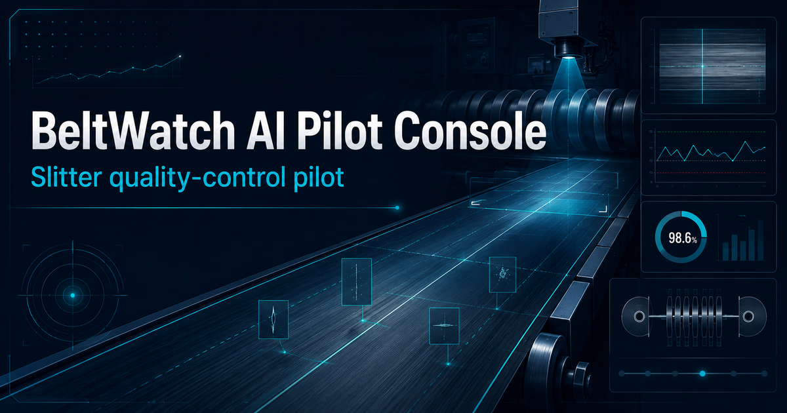
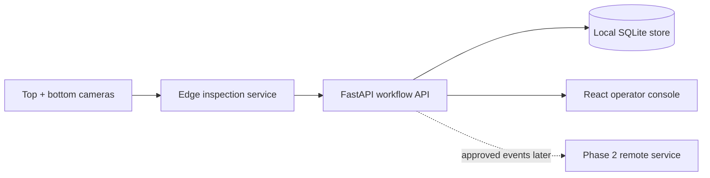

# BeltWatch AI

Local-first visual quality-control pilot for industrial belt slitting.



*Concept visual for the slitter pilot; the runnable console and synthetic-data
workflow are implemented in this repository.*

**Live UI previews (synthetic demonstration data only):**
[Phase 1 local slitter console](https://beltwatch-pilot-console.kleated.chatgpt.site) ·
[Phase 2 remote command-center concept](https://beltwatch-health-command.kleated.chatgpt.site)

> **Portfolio status:** The inspection workflow, React console, FastAPI API,
> SQLite persistence, event review, reporting, and containerized local deployment
> are implemented. Camera feeds and detections are simulated. A trained production
> vision model and live machine integration are pilot-stage work—not claims of this repository.

## Why I built it

Industrial belt inspection is a physical workflow, not just a model endpoint.
Operators need repeatable imaging, target dimensions, evidence at a known footage
position, clear disposition controls, and a system that continues working inside a
plant even when internet access is limited.

BeltWatch began with stakeholder discovery around a real slitting workflow. I
translated that into a narrow Phase 1 pilot: inspect the top and bottom surfaces,
measure width against a tolerance, track progress to a target cut length, create
reviewable anomaly events, and keep the operator authoritative.

## What the working demo proves

- End-to-end React → FastAPI → SQLite workflow
- Roll, work order, operator, target width, tolerance, and target length setup
- Start, pause, resume, progress, and completion state
- Simulated top/bottom inspection feeds and measurement telemetry
- Swappable detection-provider boundary for later camera/model integration
- Persisted anomaly evidence metadata and operator review decisions
- Acknowledged versus false-positive classification for future evaluation sets
- Audit trail and session report export
- Docker-based local deployment with no public inbound dependency
- Clear safety boundary: assistive inspection only; no machine control

## Architecture



The public build substitutes a `SimulatedDetector` for camera/model inference.
The provider boundary is deliberate: the operator workflow and event contract can
be tested before the hardware and model are trusted.

Read the [architecture decision record](docs/architecture.md) for deployment and
integration reasoning.

## Run it

### Docker (recommended)

```bash
docker compose up --build
```

Open the console at <http://localhost:5173> and API docs at
<http://localhost:8000/docs>.

### Local development

Backend (Python 3.12):

```bash
cd backend
python -m venv .venv
source .venv/bin/activate        # Windows: .venv\Scripts\activate
pip install -r requirements-dev.txt
uvicorn app.main:app --reload
```

Frontend (Node 20+):

```bash
cd frontend
npm install
npm run dev
```

## Demo workflow

1. Start an inspection with the sample roll metadata.
2. Watch footage and target-length progress advance.
3. Create an edge defect or width-deviation event.
4. Select the event to review its camera, location, measurement, and confidence.
5. Acknowledge it or mark it as a false positive.
6. Export the session report.

## API surface

| Method | Route | Purpose |
|---|---|---|
| `GET` | `/api/health` | Deployment and safety-mode health |
| `POST` | `/api/session/start` | Create and start an inspection |
| `POST` | `/api/session/pause` | Pause or resume without losing data |
| `POST` | `/api/session/progress` | Advance synthetic pilot telemetry |
| `POST` | `/api/events/simulate` | Exercise the detection-to-review path |
| `POST` | `/api/events/{id}/review` | Persist operator disposition and note |
| `GET` | `/api/audit` | Inspect the operational audit trail |

## Capability matrix

| Capability | Status | Evidence |
|---|---|---|
| Operator pilot console | Implemented | React app in `frontend/` |
| Session/event persistence | Implemented | FastAPI + SQLite in `backend/` |
| Review/audit workflow | Implemented | API routes and integration tests |
| Local container deployment | Implemented | `docker-compose.yml` |
| Camera feed UI | Simulated | Clearly labeled synthetic belt views |
| Detection results | Simulated | `SimulatedDetector` behind a provider interface |
| Live industrial camera ingestion | Planned pilot integration | Hardware validation required |
| Trained production defect model | Planned pilot integration | Data collection/evaluation required |
| Remote multi-plant command center | Phase 2 concept | Architecture only in this repository |
| Machine control | Out of scope | System is observation-only |

## Engineering decisions

- **Local first:** inspection should continue during an internet outage.
- **No Phase 1 production-system integration:** roll metadata is entered manually,
  keeping the pilot isolated from inventory and control systems.
- **No direct internet exposure:** future remote access uses encrypted outbound
  synchronization, not a forwarded FastAPI port.
- **Event first:** raw continuous video remains local by default; selected evidence
  can be synchronized later with customer approval.
- **Human in the loop:** the operator reviews detections and remains authoritative.

See [secure deployment notes](docs/security.md) and the
[pilot validation plan](docs/pilot-plan.md). The
[forward-deployed engineering case study](docs/fde-case-study.md) explains how
discovery, implementation, enterprise constraints, stakeholder communication, and
live troubleshooting shaped the system.

## Tests

```bash
cd backend
pytest -q
```

The integration test covers the critical path: health → session start → telemetry
progress → detection → operator review → summary and audit verification.

## What I would build next

1. Camera adapter and frame timestamp/position synchronization
2. Calibration workflow with stored calibration version
3. Labeled baseline dataset and repeatable evaluation harness
4. Defect clip/snapshot storage with configurable retention
5. Authentication, role-based authorization, and HTTPS reverse proxy
6. Outbound-only Phase 2 event synchronization and multi-tenant isolation
7. Operational metrics, structured logging, and restart-safe service management

## Project context

This public repository is a sanitized engineering portfolio. It uses synthetic
rolls, work orders, operators, telemetry, images, and detections. It contains no
customer data, plant layouts, credentials, proprietary production records, or
trained model weights.

Built by **Kitsommad Kaedaeng** as an end-to-end physical-AI deployment case study.
